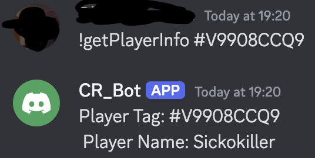

# cr_discord_bot
The bot can be used by downloading the code and adding your own Clash Royale API key and creating your own Discord Bot and adding the API token from Clash Royale API and Discord to an .env file and naming them CLASH_API_KEY and DISCORD_API_KEY.

Right now the bot had following commands: 
    !PlayerInfo "player tag"
    !ClanInfo "clan tag"

This returns the player tag and the player name right now. But will in future return more data about the player. Also a command for clan info that returns clan tag and and name is implemented.

The bot gets its data from the Clash Royale api. The fetching of the data for players is done in the playerInfo.py file. For clan info the same happens in the clanInfo.py file.
